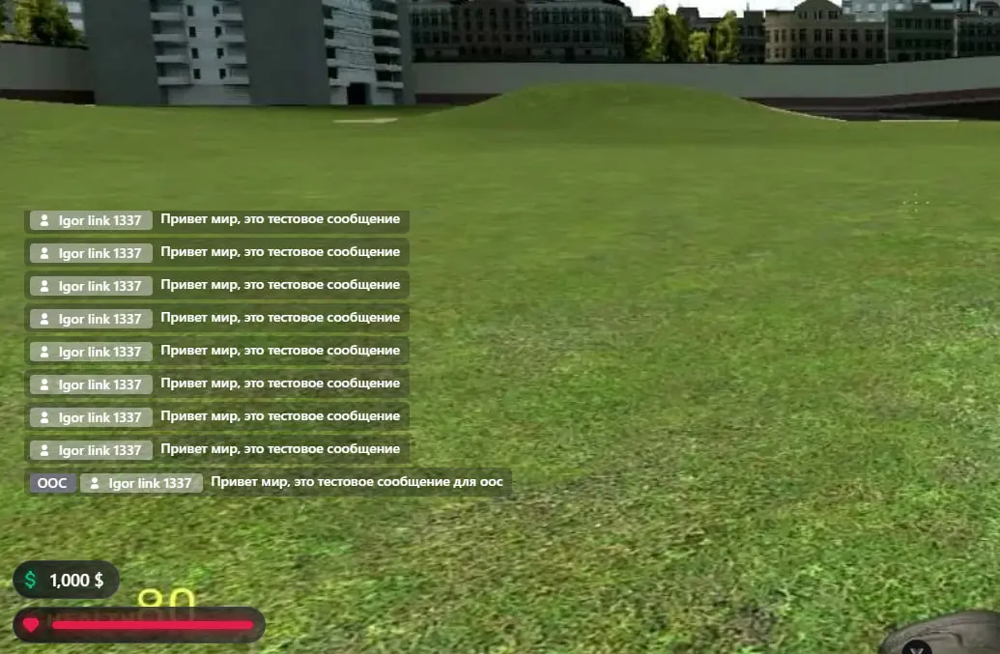
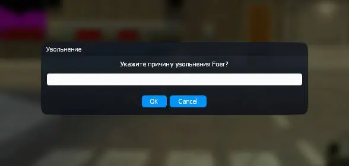
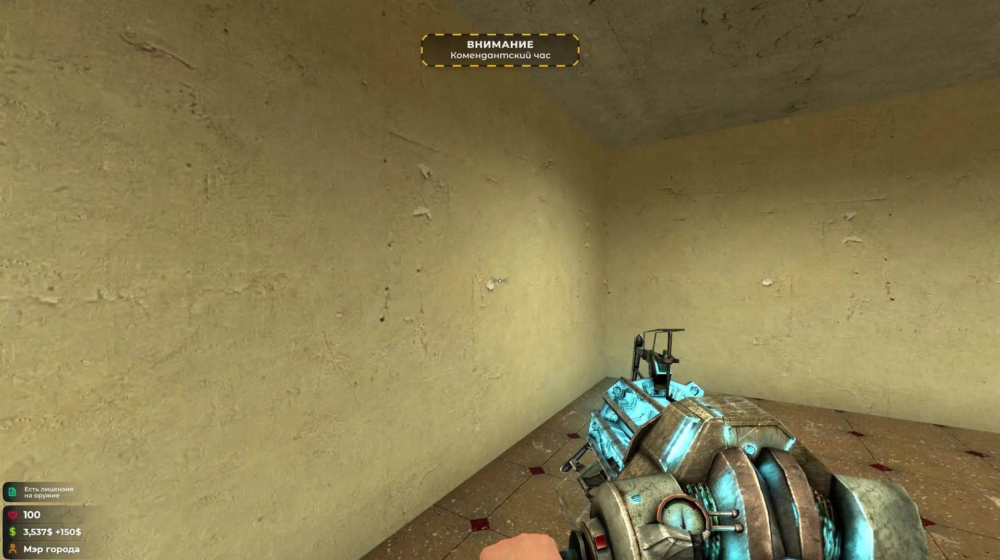

В этом обновлении полностью поменялся подход к отрисовке всей визуальной части сервера из-за этого повышена оптимизация и у нас больше развязаны руки в создании GUI интерфейсов.  
Из минусов, сервер будет доступен только для версии игры Chromium 😅

Из примеров нового UI уже имеется HUD и Чат.

В любом случае это только первая версия HUD'a, но сам результат новых возможностей радует)

### Механики
1. Новые функции в контекстом меню (Личное сообщение, система голосований на увольнение, денежные операции и девтулзы)  

2. Собственный DermaSkin  

3. Вернул обратно гравити ган вместо рук (ранее руками можно было таскать ентити)  
4. Визуал для ком.часа  

5. Новые чатовые команды: /advert (платный), /vote, /demote, /me

Напомню, что делаю режим с нуля, по этому не ворчите)