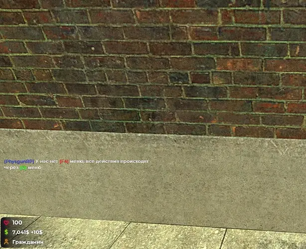
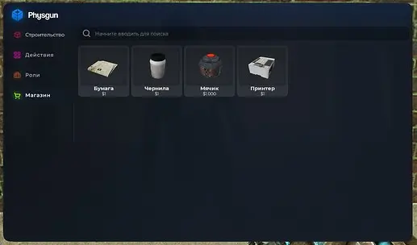

> ⚠️ Этот пост я писал для форума, так-что извините если тут есть ошибки)

Даже не знаю как тактировать данный пост, но вот такой Gamemode - (DarkRP), который я делал еще год назад, у меня есть.
Воодушевился самописом SUP и решил сделать свой gamemode, вообще без Ctrl+C/V (тут поправка, тут правда вышло без пастинга т.к делал грубо говоря в поле на ноуте)
### Визуал

Вот как выглядит HUD и кастомный Croshair, с худом вообще было много проблем со стороны дизайна и оптимизации, я понимал что рисовать много элементов это вообще не круто и плохо сказывается на оптимизации, по этому решил отрисовать всего 4 элемента. При чем если значения не изменяются то происходит рендер всех компонентов в одну картинку. А по поводу дизайна много было нюансов как сохранить стиль минимализма и так называемого "Типичного дурка рпшного худа".

---

Чат получился типикал, еще с моего старого сервера SCP:LC, просто адаптировал под стилистику сервера, особых функций в нем нет.

---

F4 меню, вот тут я решил сделать смелый шаг, вообще убрать его, за место открытия мы получаем в чат такое сообщение)

А само Q Menu выглядит таким образом.

Поигравшись с визуалом, получилось написать свою Derma Библиотеку которая работает по точно такому же принципу как и стандартная Derma.
Тут все четко и ясно и как мне кажется крайне удобно (особенно когда нет 1001'ой менюшки на сервере)

Еще пара скринов

Двери кстати типикал

тоже ничего особенного.